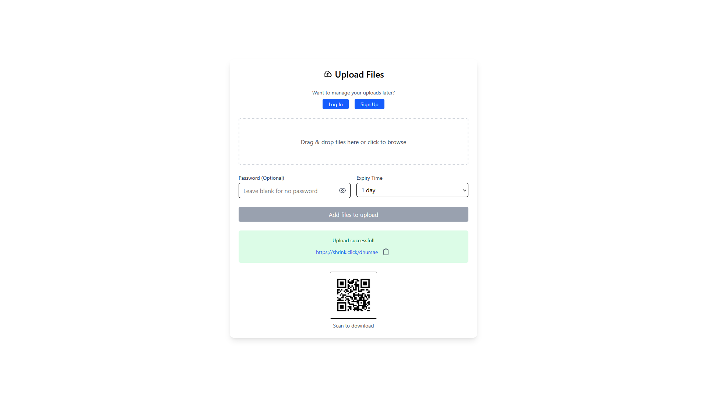
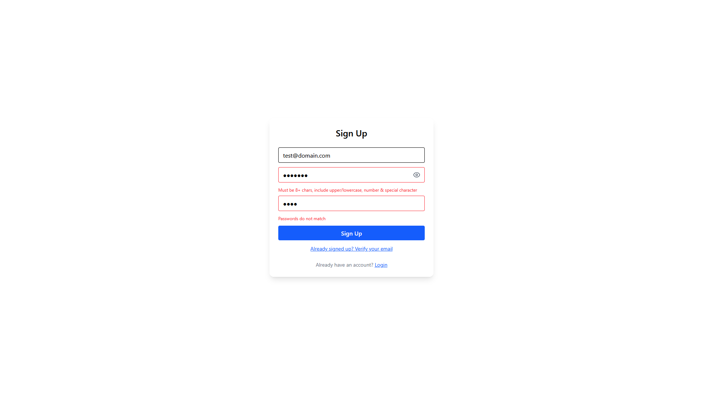
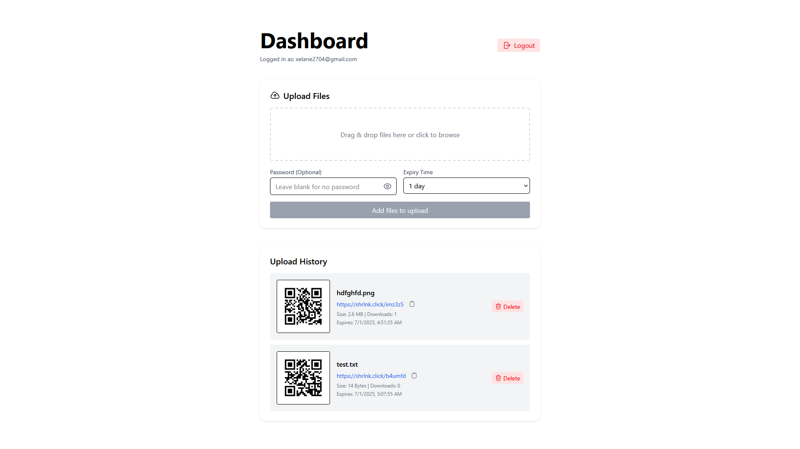

# ShareLink 🔗

A full-stack secure file-sharing platform that lets users upload files, generate short links, protect downloads with passwords, set expiry times, and track download stats — all powered by AWS.

Live: [https://shrlnk.click](https://shrlnk.click)

---

## ✨ Features

- 🔐 **Password-protected downloads**
- ⏳ **Expiring links** (1–168 hours)
- 🗂️ **Multi-file uploads** (auto-zipped)
- 📆 **30MB max upload, 5 files limit**
- 📟 **Download stats + metadata**
- 👤 **User-authenticated dashboard**
- 📱 **QR code support for links**
- ⚡ **Clean short URLs like** `shrlnk.click/abc123`
- ☁️ **AWS-integrated** (S3, Cognito, DynamoDB)
- 🐳 **Docker-ready for local/cloud deployment**


---

## 🖼️ Screenshots






---

## 🛠️ Tech Stack

### Frontend

- React (Vite)
- Tailwind CSS
- Heroicons
- Hosted on Northflank + Custom Domain

### Backend

- Spring Boot (Java 17)
- AWS SDK v2 (S3 + DynamoDB)
- Amazon Cognito (JWT auth)
- BCrypt (password encryption)
- ZXing (QR Code generation)
- Scheduled AWS Lambda for cleanup

### Infrastructure

- AWS S3 — File Storage
- AWS DynamoDB — Metadata + Tracking
- AWS Cognito — User Login System
- AWS Lambda — Auto deletion
- Docker + Nginx
- Northflank (Cloud Hosting)

---

## 🚀 Usage

### Uploading

- Select up to **5 files** (total <= 30MB)
- Choose expiry time (1h – 168h)
- Optionally add a password
- Get a **short link** + **QR code** instantly

### Downloading

- Access via short link (`shrlnk.click/abc123`)
- Enter password (if required)
- Download the original file or a zip

### Dashboard (Authenticated)

- Secure login with Cognito
- View all your uploaded files
- See expiry, download count, size
- Delete links on demand

---

## 📦 Deployment

### Backend (Docker)

```bash
docker build -t sharelink-backend .
docker run -p 8080:8080 sharelink-backend
```

### Frontend (Docker)

```bash
docker build -t sharelink-frontend .
docker run -p 80:80 sharelink-frontend
```

### Environment Variables

Set via deployment platform (e.g., Northflank):

Backend:

- `AWS_ACCESS_KEY_ID`
- `AWS_SECRET_ACCESS_KEY`
- `AWS_REGION`
- `AWS_S3_BUCKET`
- `COGNITO_CLIENT_ID`
- `COGNITO_USER_POOL_ID`
- `COGNITO_JWKS_URL`
- `APP_BASE_URL` (e.g., `https://shrlnk.click`)
- `APP_CORS_ALLOWED_ORIGINS` (e.g., `https://shrlnk.click`)

Frontend:

- `VITE_API_BASE` (e.g., `https://shrlnk.click/api`)
- `VITE_COGNITO_USER_POOL_ID`
- `VITE_COGNITO_CLIENT_ID`
- `VITE_COGNITO_REGION`
- `VITE_BASE_URL` (e.g., `https://shrlnk.click`)

---

## 📊 AWS Setup

### Required

- **S3 Bucket** — `sharelink-bucket`
- **DynamoDB Table** — `ShareLinks`
- **Cognito User Pool + App Client** — For login/auth
- **IAM Role + Policy** — With permissions to access S3 and DynamoDB
- **Lambda Function (Optional)** — For expired file cleanup (e.g., every 15 minutes)

---

## 📄 License

MIT License. See [LICENSE](LICENSE).

---

## 🙌 Acknowledgements

- [Tailwind CSS](https://tailwindcss.com/)
- [Heroicons](https://heroicons.com/)
- [ZXing](https://github.com/zxing)
- [AWS SDK for Java](https://docs.aws.amazon.com/sdk-for-java/)
- [Northflank](https://northflank.com/)


