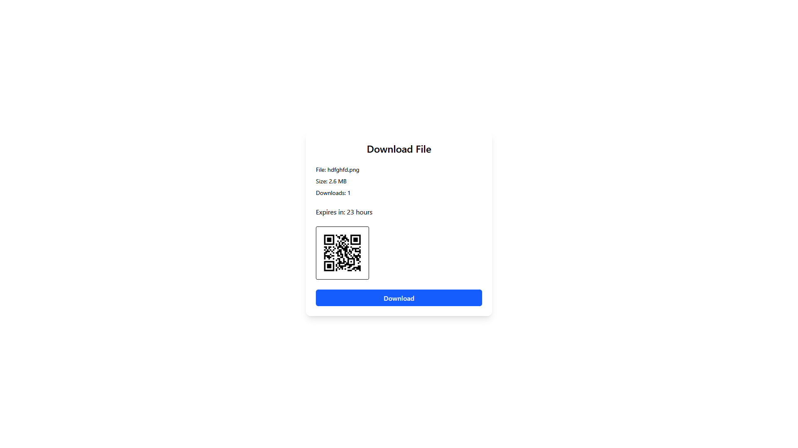

# ShareLink

A secure file-sharing platform with expiring links and password protection. Upload files, get short URLs, and track downloads.

**Live:** [https://shrlnk.click](https://shrlnk.click)

## Features

- Password-protected downloads
- Expiring links (1-168 hours)
- Multi-file uploads (auto-zipped if multiple files)
- 30MB max upload, 5 files limit
- Download stats and metadata tracking
- User dashboard with authentication
- QR code generation
- Clean short URLs: `shrlnk.click/abc123`
- AWS integration (S3, Cognito, DynamoDB)

## Tech Stack

**Frontend:** React (Vite), Tailwind CSS  
**Backend:** Spring Boot (Java 17), AWS SDK v2  
**Infrastructure:** AWS S3, DynamoDB, Cognito, Lambda  
**Deployment:** Docker, Northflank

## Screenshots




## Usage

**Uploading:**
- Select up to 5 files (total ≤ 30MB)
- Set expiry time and optional password
- Get short link + QR code

**Dashboard:**
- Login to view your uploads
- See expiry times, download counts
- Delete links manually

## Local Development

Backend:
```bash
docker build -t sharelink-backend .
docker run -p 8080:8080 sharelink-backend
```

Frontend:
```bash
docker build -t sharelink-frontend .
docker run -p 80:80 sharelink-frontend
```

## Environment Variables

Set these in your deployment platform:

**Backend:**
```
AWS_ACCESS_KEY_ID
AWS_SECRET_ACCESS_KEY  
AWS_REGION
AWS_S3_BUCKET
COGNITO_CLIENT_ID
COGNITO_USER_POOL_ID
APP_BASE_URL
```

**Frontend:**
```
VITE_API_BASE
VITE_COGNITO_USER_POOL_ID
VITE_COGNITO_CLIENT_ID
VITE_BASE_URL
```

## AWS Setup

- **S3 Bucket** — `sharelink-bucket`
- **DynamoDB Table** — `ShareLinks`
- **Cognito User Pool + App Client** — For login/auth
- **IAM Role + Policy** — With permissions to access S3 and DynamoDB
- **Lambda Function** — For cleaning up expired files
